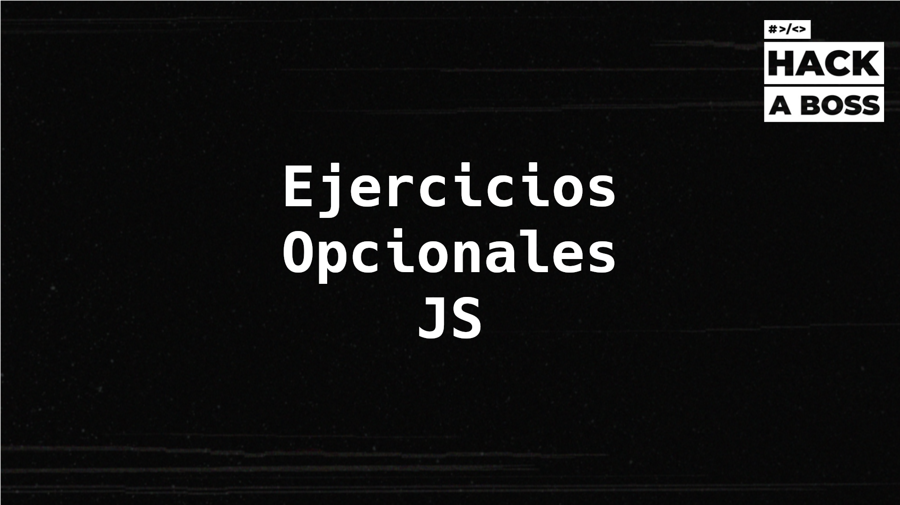

# Ejercicios Opcionales JavaScript

## Índice

### [01. Práctica JavaScript - Parte 1](./01-Practica-JS-Parte-1.md)

- Ejercicio 1: Creación de archivos HTML y JavaScript, y uso de `console.log`.
- Ejercicio 2: Uso del modo estricto y errores con palabras reservadas.
- Ejercicio 3: Declaración de variables.
- Ejercicio 4: Interpolación de variables en cadenas de texto.
- Ejercicio 5: Determinación de la longitud de una cadena de caracteres.

### [02. Práctica JavaScript - Parte 2](./02-Practica-JS-Parte-2.md)

- Ejercicio 6: Operaciones matemáticas básicas.
- Ejercicio 7: Generación de números aleatorios.
- Ejercicio 8: Comparaciones y operadores booleanos.
- Ejercicio 9: Condicionales y uso del operador módulo `%`.
- Ejercicio 10: Evaluación de condiciones con operadores lógicos.

### [03. Práctica JavaScript - Parte 3](./03-Practica-JS-Parte-3.md)
- Ejercicio 11: Uso de _loops_ para imprimir números impares.
- Ejercicio 12: Bucles para la generación de una tabla de multiplicar.
- Ejercicio 13: Creación y uso básico del objeto _Date_.

### [04. Práctica JavaScript - Parte 4](./04-Practica-JS-Parte-4.md)
- Ejercicio 14: Creación de funciones y parámetros.
- Ejercicio 15: Funciones anónimas y retorno de valores.
- Ejercicio 16: Funciones de flecha.
- Ejercicio 17: _Loops_ y condiciones en funciones.

### [05. Práctica JavaScript - Parte 5](./05-Practica-JS-Parte-5.md)
- Ejercicio 18: Creación y métodos de objetos.
- Ejercicio 19: Recorrido de propiedades de objetos con `for/in`.
- Ejercicio 20: Uso del operador de encadenamiento opcional (`?.`).
- Ejercicio 21: Copia de objetos con el _spread operator_.
- Ejercicio 22: Desestructuración de objetos.

### [06. Práctica JavaScript - Parte 6](./06-Practica-JS-Parte-6.md)
- Ejercicio 23: Acceso a elementos de arrays.
- Ejercicio 24: Recorrido de arrays con `for/of`.
- Ejercicio 25: Modificación de arrays con `push()`.
- Ejercicio 26: Modificación de arrays con `splice()`.
- Ejercicio 27: Búsqueda de elementos en arrays con `includes()`.

### [07. Práctica JavaScript - Parte 7](./07-Practica-JS-Parte-7.md)
- Ejercicio 28: Búsqueda en arrays con `find()`.
- Ejercicio 29: Transformación de arrays con `map()`.
- Ejercicio 30: Filtrado de arrays con `filter()`.
- Ejercicio 31: Reducción de arrays con `reduce()`.
- Ejercicio 32: Ordenación de arrays con `sort()`.

### [08. Práctica JavaScript - Parte 8](./08-Practica-JS-Parte-8.md)
- Ejercicio 33: Conversión y manipulación de datos JSON.
- Ejercicio 34: Conversión de JSON a objeto JavaScript.
- Ejercicio 35: Generación de números aleatorios con IIFE.
- Ejercicio 36: Creación y uso de _closures_.

### [09. Práctica JavaScript - Parte 9](./09-Practica-JS-Parte-9.md)
- Ejercicio 37: Uso de `setTimeout`.
- Ejercicio 38: Uso de `setInterval`.
- Ejercicio 39: Creación y manejo de promesas.
- Ejercicio 40: Peticiones HTTP con `fetch` y `then`.
- Ejercicio 41: Peticiones HTTP con `fetch` y `async/await`.
- Ejercicio 42: Uso de módulos ES6.

