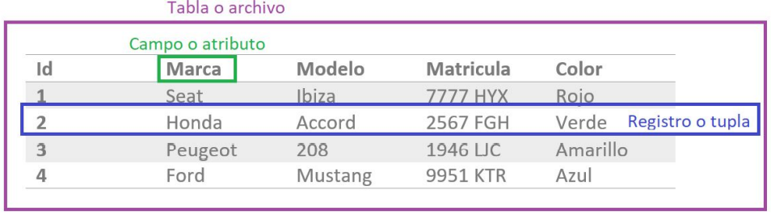

Es esencial comprender algunos conceptos clave para poder trabajar eficazmente con SQL. A continuación, se presentan conceptos fundamentales que sientan las bases para un manejo exitoso de bases de datos relacionales:

- **Campo o atributo:** cada columna de una tabla, que define un tipo específico de dato. Una vez definido, un campo solo puede contener datos del tipo especificado.
    

- **Registro o tupla:** cada fila en una tabla, que contiene un conjunto de datos relacionados. Estos datos pueden abarcar diferentes tipos, representando una entidad específica en la base de datos.
    

- **Tabla o archivo:** una estructura que agrupa registros con atributos similares. Una tabla es la representación de una entidad en la base de datos, donde cada registro se ajusta a un conjunto de atributos predefinidos.



## Sintaxis en _MySQL_

Aunque la sintaxis SQL no distingue entre mayúsculas y minúsculas, es una buena práctica escribir las palabras clave SQL en mayúsculas para mejorar la legibilidad de tus consultas.

Cada sentencia SQL debe terminar obligatoriamente con un punto y coma (`;`).

## Clave primaria (_Primary Key_)

Una **_clave primaria_** (**_primary key_**) en una tabla de base de datos es una columna o grupo de columnas que identifica de manera única cada fila en esa tabla. Cada tabla puede tener solo una _clave primaria_ y su valor debe ser único y no nulo.

Para definir una _clave primaria_ utiliza la restricción `PRIMARY KEY`.

Puedes definir una _clave primaria_ directamente en la declaración de la columna, como se muestra a continuación:

```sql
id INT UNSIGNED PRIMARY KEY
```

También puedes definir la _clave primaria_ al final de la declaración de todas las columnas, de la siguiente manera:

```sql
id INT UNSIGNED,
PRIMARY KEY (id)
```

## Autoincremento

La restricción `AUTO_INCREMENT` es particularmente útil cuando se aplica a columnas que se definen como claves primarias, siempre y cuando estas columnas sean de tipo entero. Al aplicar esta restricción, el Sistema de Gestión de Base de Datos (_SGBD_) se encarga de asignar automáticamente un valor a esta columna, incrementándose de forma secuencial con cada nueva fila que se inserta en la tabla.

Para definir una columna con autoincremento, puedes añadir la restricción `AUTO_INCREMENT` en la definición de la columna que has definido como clave primaria:

```sql
id INT UNSIGNED PRIMARY KEY AUTO_INCREMENT
```

## Clave foránea (_Foreign key_)

Una **_clave foránea_** está formada por una columna que hace referencia a una _clave primaria_ de otra tabla. Se pueden definir tantas _claves ajenas_ como sea necesario (no hay límite). El valor de la columna o columnas que son _clave foránea_ será `NULL`, o bien el valor de la _clave primaria_ de la tabla a la que hacen referencia (integridad referencial). Así, a la hora de definir una _clave ajena_, deberás indicar con la cláusula _REFERENCES_ la tabla a que ésta hace referencia (se tomará automáticamente la _clave primaria_ de ésta como campo con el que mantener la integridad referencial).

Ten en cuenta que, mientras que un campo definido como _clave ajena_ haga referencia a un campo definido como _clave primaria_, la columna de la segunda tabla no podrá ser eliminada hasta que no lo haga la columna que le hace referencia (integridad referencial). Para evitar estos problemas (aunque no siempre es un problema) puedes definir la restricción de _clave ajena_ añadiendo la cláusula `ON DELETE` o bien `ON UPDATE` para el caso de una actualización. De esa manera, cuando vayas a eliminar o actualizar una fila a cuya _clave primaria_ se haga referencia, puedes indicar a _MySQL_ que operación quieres realizar con las filas que le hacen referencia:

● **_RESTRICT_**: Se rechaza la operación de eliminación/actualización.

● **_CASCADE_**: Realiza la operación y se elimina o actualiza en cascada en las filas que hacen referencia.

● **_SET NULL_**: Realiza la operación y fija a `NULL` el valor en las filas que hacen referencia.

● **_NO ACTION_**: Se rechaza la operación de eliminación/actualización, como ocurre con la opción _RESTRICT_

Aquí te dejo unos ejemplos de cómo definir _claves ajenas_ con diferentes cláusulas en SQL:

```sql
FOREIGN KEY(studentId) REFERENCES students(id)

FOREIGN KEY(studentId) REFERENCES students(id) ON DELETE CASCADE
```

Al definir _foreign key_ en _MySQL_, ten en cuenta lo siguiente:

- La columna debe ser del mismo tipo y tener los mismos atributos que la columna a la que hace referencia.
    
- La columna debe ser un índice.
    
- Si la columna se define como obligatoria (`NOT NULL`) no puede contener la cláusula (`SET NULL`) para los casos de borrado (`ON DELETE`) o actualización (`ON UPDATE`).

```sql
studentId INT UNSIGNED,
FOREIGN KEY(studentId) REFERENCES students(id) ON DELETE SET NULL
```

## Campos obligatorios

Puedes definir una columna como obligatoria, es decir, que siempre debe tener un valor y no puede ser `NULL`. Para esto, se utiliza la restricción `NOT NULL`.

```sql
name VARCHAR(30) NOT NULL,
```

En este caso, la columna _name_ debe contener un valor y no puede ser `NULL`

## Valores por defecto

También puedes establecer un valor por defecto para una columna. Este valor se utilizará cuando no se especifique ningún valor al introducir una nueva fila en la tabla. Para esto, se utiliza la restricción `DEFAULT`.

```sql
createdAt DATETIME DEFAULT CURRENT_TIMESTAMP

name VARCHAR(30) DEFAULT 'Sin nombre'
```

En el primer caso, si no se especifica un valor para la columna _createdAt_, se utilizará el valor de la fecha y hora actual. En el segundo caso, si no se especifica un valor para la columna _name_, se utilizará el valor "Sin nombre".

## Condiciones

En SQL, puedes forzar a que los valores de determinados campos de la tabla cumplan unas ciertas condiciones. En caso contrario no se permitirá la inserción de esa fila en dicha tabla.

```sql
age INT CHECK (age > 0),

course INT CHECK (course BETWEEN 1 AND 2),
```

Sin embargo, **en _MySQL_ estas restricciones no se aplican** y se utiliza `ENUM` para especificar valores válidos:

```sql
course ENUM('0', '1', '2')

sport ENUM('football', 'basketball', 'tennis')
```

## Valores únicos

La restricción `UNIQUE` asegura que todos los valores en una columna son únicos. Al contrario que ocurre con la restricción `PRIMARY KEY`, `UNIQUE` puede aplicarse a varias columnas de una misma tabla y permite el valor `NULL`. Sin embargo, solo puede haber una fila con el valor `NULL` si la columna se define como `UNIQUE`.

```sql
email VARCHAR(100) UNIQUE,
```

## Comentarios

En SQL, puedes agregar comentarios a tu código que no se ejecutarán. Los comentarios se pueden hacer de una sola línea o de varias líneas.

```sql
-- Esto es un comentario y MySQL no lo ejecuta.

/* Esto es un comentario de bloque
   y en MySQL tampoco se ejecuta. */
```

## Creación de _scripts_ en _MySQL_

Los _scripts_ SQL son una forma efectiva de trabajar con bases de datos relacionales como _MySQL_. Consisten en archivos de texto que contienen una serie de instrucciones SQL, las cuales se ejecutan una tras otra. Cada sentencia se separa por un punto y coma (`;`).

Por ejemplo, puedes crear un _script_ para generar una nueva base de datos y sus respectivas tablas. Aquí te dejo un ejemplo de cómo podría ser este _script_:

```sql
CREATE DATABASE IF NOT EXISTS bootcamp;
USE bootcamp;

CREATE TABLE IF NOT EXISTS students (
    id INT UNSIGNED PRIMARY KEY AUTO_INCREMENT,
    ...
    ...
);

CREATE TABLE IF NOT EXISTS subjects (
    id INT UNSIGNED PRIMARY KEY AUTO_INCREMENT,
    ...
    ...
);
```

## Consejos Generales para Scripts SQL

- Evita acentos, el carácter `ñ` y otros caracteres especiales (`|` `@` `#`…) para los nombres de bases de datos, tablas, columnas o cualquier otro elemento.
    
- Escribe las palabras reservadas del lenguaje _SQL_ en mayúsculas.
    
- Asegúrate de que todas las tablas tengan un campo clave primario, como `id` (definido como `id INT UNSIGNED PRIMARY KEY AUTO_INCREMENT`).
    
- Cuando nombres **_foreign keys_** , incluye la tabla a la que hacen referencia (en singular) como parte de su nombre. Por ejemplo, `teamId` si es una _clave ajena_ de la tabla `teams`. Si una tabla tiene dos _foreign keys_ que apuntan a la misma tabla, añade algo al nombre para distinguirlas (**_localTeamId_** y **_visitorTeamId_**, por ejemplo).
    
- Es recomendable que los nombres de las tablas estén en plural (**_users_** mejor que **_user_**, **_orders_** mejor que **_order_**).
    
- Antes de definir un tipo de dato como numérico, comprueba si realmente se va a operar con él como tal.
    
- Cuidado con los campos contraseña. Realmente nunca se guarda tal cual sino como un _hash_ utilizando algún algoritmo, por lo que la longitud real es mayor.

> **Importante:** Generalmente en SQL se recomienda utilizar la notación _snake lower case_ (cada espacio se reemplaza con un guion bajo `_` sin letras mayúsculas) para todos los identificadores (nombre de la base de datos, nombres de tablas y nombres de columnas). Sin embargo, en este _bootcamp_ trabajaremos principalmente con JavaScript, por lo que para evitar confusiones a la hora de intercambiar información entre SQL y Node recomendamos utilizar la misma notación que utilizamos en JavaScript: _lowerCamelCase_.

