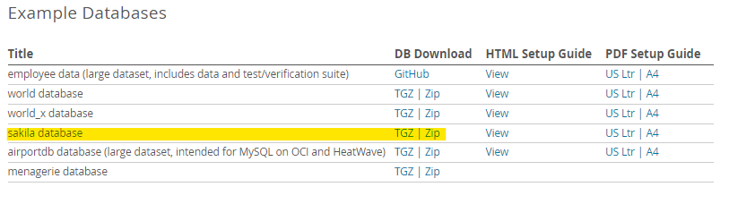
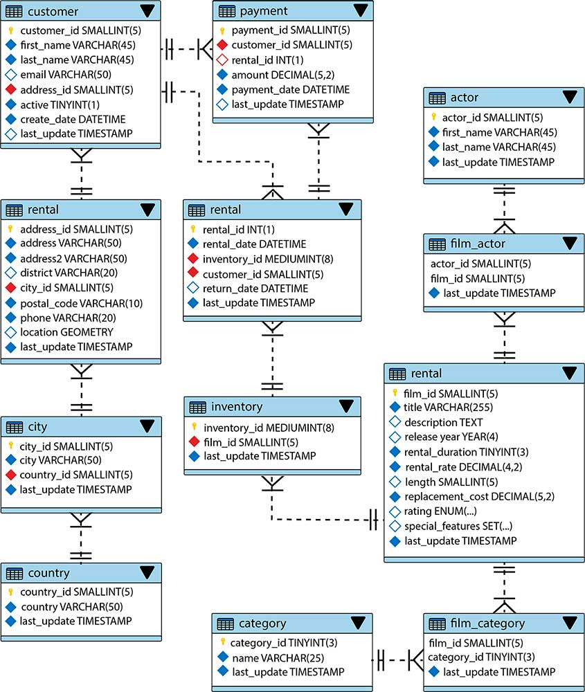

_MySQL_ pone a disposición la base de datos de muestra de **_Sakila_**. Esta _database_ contiene datos para una empresa ficticia de alquiler de películas e incluye tablas como **_store_** (tienda), **_inventory_** (inventario), **_movie_** (película), **_customer_** (cliente) y **_payment_** (pago).

## Instalación de sakila

1. Descarga los archivos para la base de datos de ejemplo _Sakila_ (en TGZ o Zip) de la sección [Examples Databases](https://dev.mysql.com/doc/index-other.html).

    

2. Extrae el contenido comprimido (`Botón derecho` sobre el archivo → `Extract here`, esto descomprimirá el fichero dentro del directorio _Downloads_).

3. Ahora abre con _MySQL Workbench_ el archivo `sakila-schema.sql` y ejecútalo.

4. Haz lo mismo con `sakila-data.sql`. Es importante que lo hagas en este orden o no funcionará.

Tras estos pasos ya deberías tener la base de datos _Sakila_ con todos los datos necesarios para los ejemplos de esta documentación.

Para asegurarte de que todo ha salido correctamente prueba a listar las tablas de la base de datos. Posteriormente trata de seleccionar todas las filas de la tabla de actores:

```sql
USE sakila;

-- Muestra todas las tablas de la base de datos seleccionada.
SHOW TABLES;

-- Muestra todos los registros de la tabla de actores.
SELECT * FROM actor;
```

A partir de este punto, para la mayoría de los ejemplos, utilizaremos la base de datos de muestra denominada _Sakila_. Esta base de datos representa una cadena de tiendas de alquiler de DVD. Aunque el modelo pueda parecer obsoleto, es ideal para ilustrar los ejemplos que presentaremos. Puedes ver el esquema completo de sus tablas, columnas y las relaciones entre ellas en el diagrama siguiente:



Para que sea más fácil entender el esquema, se muestran algunas de las tablas utilizadas en el esquema de _Sakila_, junto a una breve definición de cada una:

| Nombre de la tabla | Definición                                            |
| ------------------ | ----------------------------------------------------- |
| **_film_**           | Una película que se ha estrenado y se puede alquilar. |
| **_actor_**          | Una persona que actúa en películas.                   |
| **_customer_**       | Una persona que ve películas.                         |
| **_category_**       | Un género de películas.                               |
| **_payment_**        | El alquiler de una película por un cliente.           |
| **_language_**       | Un lenguaje hablado por los actores de una película.  |
| **_film_actor_**     | Un actor en una película.                             |
| **_inventory_**      | Una película disponible para alquilar.                |

