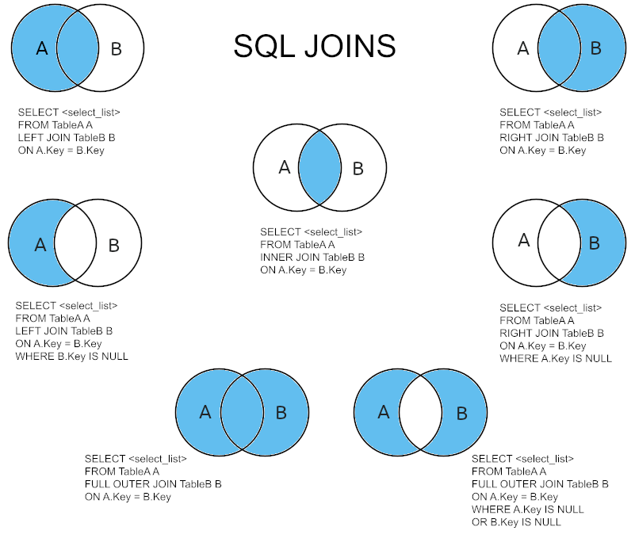

Si deseas generar un solo informe que muestre diferentes datos de distintas tablas, necesitarás un mecanismo para reunir los datos de estas dos tablas (o más); este mecanismo se conoce como **JOIN**.



## Tipos de JOIN

Hay varios tipos de `JOIN` en SQL, y cada uno sirve a un propósito específico. Los más comunes son el `INNER JOIN`, el `LEFT JOIN` y el `RIGHT JOIN`. Para los siguientes ejemplos tomaremos como muestra estas dos tablas:

| Table departments |           |
| ----------------- | --------- |
| **id**            | **name**  |
| 1                 | Ventas    |
| 2                 | Académico |
| 3                 | Marketing |
| 4                 | Talento   |

| Table employees |          |                  |
| --------------- | -------- | ---------------- |
| **id**          | **name** | **departmentId** |
| 1               | Sara     | 1                |
| 2               | Andrea   | 2                |
| 3               | Laura    | null             |
| 4               | Juan     | 2                |
| 5               | Rafa     | 3                |

### INNER JOIN

El `INNER JOIN` devuelve las filas coincidentes de ambas tablas. Imaginemos una base de datos de una empresa donde se distingue entre empleados y departamentos. Si tratásemos de unir ambas tablas con este tipo de `JOIN`, aquellos empleados que no estuviesen vinculados a un departamento, y los departamentos que no tuviesen vinculado ningún empleado no se mostrarían.

```sql
SELECT e.name AS employees, d.name AS departments FROM employees e
INNER JOIN departments d ON d.id = e.departmentId;

+------------+-------------+
| employees  | departments |
+------------+-------------+
| Sara       | Ventas      |
| Andrea     | Académico   |
| Juan       | Académico   |
| Rafa       | Marketing   |
+------------+-------------+
4 rows in set (0.03 sec)
```

> **Tip:** Cuando trabajamos con varias tablas es importante indicar qué columnas queremos mostrar y de qué tabla proviene cada columna. Para ello debemos seguir el formato `nombreTabla.nombreColumna`, por ejemplo: `employee.name`. Es posible asignar un alias a una tabla para no tener que escribir el nombre completo de la tabla. En el código anterior se asigna el alias `e` a la tabla `employees` y el alias `d` a la tabla `departments`. Basta con definir el alias justo después de mencionar el nombre de cada tabla. De esta forma, en lugar de escribir `employee.name` bastaría con `e.name`.

### LEFT JOIN

El `LEFT JOIN` devuelve todas las filas de la tabla izquierda, y las filas coincidentes de la tabla derecha. Si no hay una coincidencia, el resultado es `NULL` del lado derecho.

```sql
SELECT e.name AS employees, d.name AS departments FROM employees e
LEFT JOIN departments d ON d.id = e.departmentId;

+------------+-------------+
| employees  | departments |
+------------+-------------+
| Sara       | Ventas      |
| Andrea     | Académico   |
| Laura      | null        |
| Juan       | Académico   |
| Rafa       | Marketing   |
+------------+-------------+
5 rows in set (0.03 sec)
```

### RIGHT JOIN

El `RIGHT JOIN` funciona de manera similar al `LEFT JOIN`, pero devuelve todas las filas de la tabla derecha, y las filas coincidentes de la tabla izquierda. Si no hay una coincidencia, el resultado es `NULL` del lado izquierdo.

```sql
SELECT e.name AS employees, d.name AS departments FROM employees e
RIGHT JOIN departments d ON d.id = e.departmentId;

+------------+-------------+
| employees  | departments |
+------------+-------------+
| Sara       | Ventas      |
| Andrea     | Académico   |
| Juan       | Académico   |
| Rafa       | Marketing   |
| null       | Talento     |
+------------+-------------+
5 rows in set (0.03 sec)
```

## Ejemplos con sakila-db

Para ilustrar, veamos las definiciones de las tablas **_customer_** y **_address_** y definamos posteriormente una consulta que recupere los datos de ambas tablas:

| Table customer |                      |
| -------------- | -------------------- |
| **Field**      | **Type**             |
| customer_id    | `SMALLINT(5) UNSIGNED` |
| store_id       | `TINYINT(3) UNSIGNED`  |
| first_name     | `VARCHAR(45)`          |
| last_name      | `VARCHAR(45)`          |
| email          | `VARCHAR(50)`          |
| address_id     | `SMALLINT(5) UNSIGNED` |
| active         | `TINYINT(1)`           |
| create_date    | `DATETIME`             |
| last_update    | `TIMESTAMP`            |

| Table address |                      |
| ------------- | -------------------- |
| **Field**     | **Type**             |
| address_id    | `SMALLINT(5) UNSIGNED` |
| address       | `VARCHAR(50)`          |
| address2      | `VARCHAR(50)`          |
| district      | `VARCHAR(20)`          |
| city_id       | `SMALLINT(5) UNSIGNED` |
| postal_code   | `VARCHAR(10)`          |
| phone         | `VARCHAR(20)`          |
| location      | `GEOMETRY`             |
| last_update   | `TIMESTAMP`            |

Imagina que quieres recuperar el nombre y apellido de cada cliente, junto con su dirección postal. La consulta deberá recuperar las columnas **_customer_**._first_name_, **_customer_**._last_name_, y **_address_**._address_.

Pero ¿cómo puedo recuperar datos de ambas tablas en la misma consulta? La respuesta se encuentra en la columna **_customer_**._address_id_, que contiene el _ID_ del registro del cliente en la tabla **_address_** (en términos más formales, la columna **_customer_**._address_id_ es la clave foránea de la tabla **_address_**). La consulta debe indicar al servidor que use la columna **_customer_**._address_id_ como enlace entre las tablas de **_address_** y **_customer_**, lo que permite que las columnas de ambas tablas se incluyan en el conjunto de resultados de la consulta. Este tipo de operación se conoce como `JOIN`.

```sql
SELECT c.first_name, c.last_name, a.address
FROM customer c INNER JOIN address a ON c.address_id = a.address_id;

+-------------+--------------+----------------------------------------+
| first_name  | last_name    | address                                |
+-------------+--------------+----------------------------------------+
| MARY        | SMITH        | 1913 Hanoi Way                         |
| PATRICIA    | JOHNSON      | 1121 Loja Avenue                       |
| LINDA       | WILLIAMS     | 692 Joliet Street                      |
| ...         | ...          | ...                                    |
| FREDDIE     | DUGGAN       | 1103 Quilmes Boulevard                 |
| WADE        | DELVALLE     | 1331 Usak Boulevard                    |
| AUSTIN      | CINTRON      | 1325 Fukuyama Street                   |
+-------------+--------------+----------------------------------------+
599 rows in set (0.00 sec)
```

### Unión de tres o más tablas

Cambiemos un poco la consulta anterior para devolver la ciudad del cliente en lugar de su dirección postal. El nombre de la ciudad no se almacena en la tabla de direcciones, sino que se accede a través de una _foreign key_ a la tabla **_city_**.

| Table city  |                      |
| ----------- | -------------------- |
| **Field**   | **Type**             |
| city_id     | `SMALLINT(5) UNSIGNED` |
| city        | `VARCHAR(50)`          |
| country_id  | `SMALLINT(5) UNSIGNED` |
| last_update | `TIMESTAMP`            |

Para mostrar la ciudad de cada cliente, debes pasar de la tabla **_customer_** a la tabla **_address_** usando la columna _address_id_ y luego desde la tabla **_address_** a la tabla **_city_** usando la columna _city_id_. La consulta quedaría de la siguiente manera:

```sql
SELECT c.first_name, c.last_name, ct.city
FROM customer c
INNER JOIN address a ON c.address_id = a.address_id
INNER JOIN city ct ON a.city_id = ct.city_id;

+-------------+--------------+----------------------------+
| first_name  | last_name    | city                       |
+-------------+--------------+----------------------------+
| JULIE       | SANCHEZ      | A Coruña (La Coruña)       |
| PEGGY       | MYERS        | Abha                       |
| TOM         | MILNER       | Abu Dhabi                  |
| ...         | ...          | ...                        |
| BYRON       | BOX          | Zhezqazghan                |
| GUY         | BROWNLEE     | Zhoushan                   |
| RONNIE      | RICKETTS     | Ziguinchor                 |
+-------------+--------------+----------------------------+
599 rows in set (0.03 sec)
```

