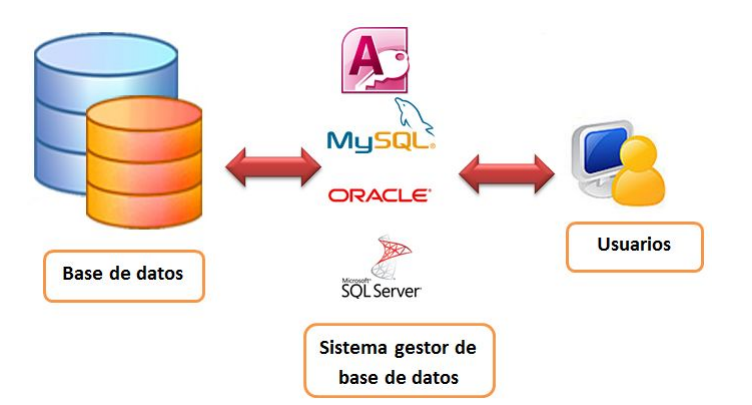

Una base de datos es, en esencia, una colección de datos estructurados y relacionados. Puedes encontrar un ejemplo cotidiano en una guía telefónica, que contiene nombres, números de teléfono y direcciones de todas las personas en una región particular.

A pesar de su utilidad, una guía telefónica tiene sus limitaciones. Por ejemplo, puede ser muy tedioso buscar el número de teléfono de una persona, sobre todo si la guía es muy extensa. Además, está indexada por apellidos y nombres, dificultando la búsqueda de personas que viven en una dirección específica. Estas limitaciones se extienden a cualquier sistema manual de almacenamiento de datos, como pueden ser los registros de pacientes en una clínica.

A nivel más general, una base de datos es cualquier recurso que recopila y organiza datos. Sin embargo, en un contexto profesional, "base de datos" se refiere normalmente a un "_Sistema de Gestión de Bases de Datos Relacionales_" (_[RDBMS](https://es.wikipedia.org/wiki/Sistema_de_gesti%C3%B3n_de_bases_de_datos_relacionales)_ en inglés), que incluye una o más tablas con datos que pueden estar relacionados entre sí.

## ¿Qué es un DBMS?

Los programas que controlan las bases de datos se conocen como "_Sistemas de Gestión de Bases de Datos_" (_[DBMS](https://es.wikipedia.org/wiki/Sistema_de_gesti%C3%B3n_de_bases_de_datos)_ , por sus siglas en inglés). Cuando necesitas recuperar información de una base de datos, haces una solicitud a través de SQL. El _DBMS_ procesa esta solicitud, recopila la información necesaria y la proporciona. _MySQL_ y _Microsoft SQL Server_ son ejemplos de _DBMS_.

## Tipos de bases de datos

Hoy en día, hay varios tipos de bases de datos que son ampliamente utilizados en la industria. Aquí te proporcionamos una breve descripción de algunos de los tipos más comunes:  

1. **Bases de datos Relacionales:** a diferencia de las bases de datos no relacionales, estas bases de datos utilizan un modelo tabular para almacenar y organizar datos en filas y columnas. Utilizan lenguajes SQL (_Structured Query Language_) para consultar y manipular datos. Ejemplos populares son _MySQL_, _PostgreSQL_ y _Microsoft SQL Server_.  
    
2. **Bases de datos No Relacionales (NoSQL):**
    
    - **Documentales:** almacenan datos en documentos flexibles similares a JSON. Son útiles para datos semiestructurados o cambiantes. Ejemplos: _MongoDB_, _Couchbase_.
        
    - **Clave-Valor:** almacenan pares clave-valor, eficientes para almacenar y recuperar datos rápidamente. Ejemplos: _Redis_, _Amazon DynamoDB_.
        
    - **Columnares:** almacenan datos en columnas, optimizados para consultas analíticas y agregaciones. Ejemplos: _Apache Cassandra_, _HBase_.
        
    - **Grafo:** almacenan datos en nodos y relaciones, ideales para representar relaciones complejas. Ejemplos: _Neo4j_, _Amazon Neptune_.
        
    - **Bases de datos en Memoria:** almacenan datos en la memoria principal para un acceso ultrarrápido. Son excelentes para aplicaciones que requieren baja latencia. Ejemplos: _Redis_, _Memcached_.  
        
3. **Bases de datos en la Nube:** estas bases de datos se ejecutan en la nube y ofrecen escalabilidad, disponibilidad y facilidad de uso. Pueden ser de diferentes tipos (relacionales, NoSQL, etc.). Ejemplos: _Amazon RDS_, _Azure Cosmos DB_.  
    
4. **Bases de datos Tiempo-Real:** diseñadas para manejar flujos de datos en tiempo real. Son ideales para aplicaciones de análisis y procesamiento en tiempo real. Ejemplos: _Apache Kafka_, _Firebase Realtime Database_.  
    
5. **Bases de datos In-Memory:** almacenan y procesan datos en la memoria para un rendimiento ultrarrápido en aplicaciones analíticas y transaccionales. Ejemplos: _SAP HANA_, _VoltDB_.  
    
6. **Bases de datos NewSQL:** una evolución de las bases de datos SQL tradicionales que abordan desafíos de escalabilidad y rendimiento. Ejemplos: _CockroachDB_, _NuoDB_.
    

La elección de la base de datos depende de los requisitos específicos del proyecto, como el volumen de datos, el tipo de datos, las consultas que necesitas realizar, la escalabilidad, la latencia y otros factores.

## ¿Por qué SQL?

El panorama empresarial cambia rápidamente y las empresas están invirtiendo grandes sumas de capital para recopilar y almacenar datos. SQL (_Structured Query Language_), que significa **lenguaje de consulta estructurado**, proporciona un medio para acceder y manipular estos datos de manera significativa, proporcionando información detallada.

> **Tip**: El proceso de petición de datos y la devolución de su resultado se llama **_consulta_** (**_query_**), de aquí el nombre de SQL (_Structured Query Language_)..

