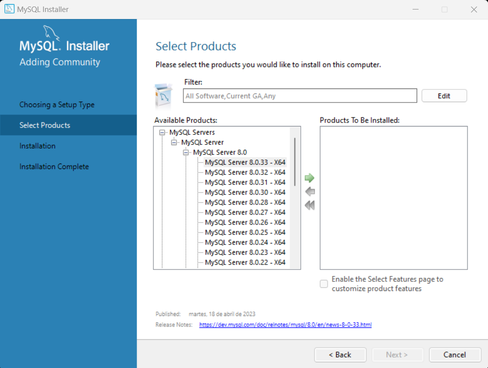

Las bases de datos relacionales han estado disponibles comercialmente durante más de tres décadas. Algunos de los productos (_RDBMS_) comerciales más populares son:

- _Oracle Database_ de Oracle Corporation.
    
- _SQL Server_ de Microsoft.
    
- _DB2 Universal Database_ de IBM
    

Junto con los servidores de bases de datos comerciales, ha existido bastante actividad en la comunidad de código abierto en las últimas dos décadas con el objetivo de crear una alternativa viable. Dos de los _servidores de bases de datos de código abierto_ más utilizados son _PostgreSQL_ y **_MySQL_**. El servidor (_RDMBS - Relational DataBase Management System_) _MySQL_ está disponible de forma gratuita, y es muy fácil descargar e instalar.

## ¿Por qué usar MySQL?

Existen varias razones para utilizar MySQL:

1. **Versatilidad**: MySQL es compatible con todos los principales sistemas operativos, incluyendo Linux, Windows, Mac, BSD y Solaris. Además, puede manejar casi cualquier tipo de base de datos, ya sea relacional o no relacional.
    
2. **Facilidad de uso**: MySQL utiliza SQL para todas sus operaciones de base de datos, que es un lenguaje estándar que es fácil de aprender y usar.
    
3. **Rendimiento**: MySQL es conocido por su velocidad y fiabilidad. Los algoritmos internos, estructuras de datos y otras implementaciones están optimizadas para manejar una gran cantidad de datos de manera eficiente.
    
4. **Seguridad**: MySQL tiene una serie de características de seguridad que garantizan que solo las personas autorizadas puedan acceder a su base de datos. Entre estas características se incluyen el cifrado de datos y el soporte para el acceso seguro a la base de datos a través de SSL.
    
5. **Soporte para transacciones**: MySQL tiene soporte completo para transacciones, lo que es crucial para asegurar que todas las operaciones de base de datos sean atómicas, consistentes, aisladas y duraderas ([ACID](https://es.wikipedia.org/wiki/ACID)).

> **Tip**: Los principios ACID (Atomicidad, Consistencia, Aislamiento y Durabilidad) son un conjunto de propiedades importantes para garantizar la integridad de los datos en las bases de datos. Sin estos principios, los datos podrían estar en un estado inconsistente o podrían perderse.


## Instalación de MySQL en Windows

La instalación de MySQL en Windows es un proceso sencillo, aunque puede variar un poco dependiendo del sistema operativo y la versión específica que estés utilizando. Por lo general, debes seguir los siguientes pasos:

1. Descarga el instalador de MySQL desde el sitio web oficial en [https://dev.mysql.com/downloads/installer/](https://dev.mysql.com/downloads/installer/).
    

2. Si te sale una ventana como la siguiente no es necesario registrarse, haz clic en _"No thanks, just start my download."_

    

3. Ejecuta el archivo del instalador que acabas de descargar.
    

4. En la pantalla de _"Choosing a Setup Type"_ selecciona la opción de _"Custom"_ para instalar solo lo que necesites. Pulsa en _"Next"_.
    

5. En la pantalla de _"Select Products"_ expande el árbol de _MySQL Servers_, expande la rama que contiene _MySQL Server 8.0_ y selecciona la versión más reciente (en el momento de escribir estas líneas es la _MySQL Server 8.0.33 - X64_), acto seguido haz clic en la primera flecha (en verde) para pasar al lado derecho que contendrá los productos que se van a instalar:

    

6. Realiza el mismo procedimiento expandiendo el árbol de _"Applications"_ -> _"MySQL Workbench 8.0"_ -> _"MySQL Workbench 8.0.33 - X64"_ (selecciona la última versión) y pulsa en la flecha `→` para pasar a los productos que que instalarán.

    

7. Una vez seleccionados tanto _MySQL Server_ como el _Workbench_, haz clic en _"Next"_ hasta que llegues a la pantalla _"Installation"_, y luego haz clic en _"Execute"_ para iniciar la instalación.
    

8. En la pantalla de _"Type and Networking"_ deja todo como está y pulsa en _"Next"_.

    

9. Llegamos a la pantalla de _"Authentication Method"_ deja la opción marcada por defecto y pulsa en _"Next"_.

    

10. En _"Accounts and Roles"_ te pedirá que ingreses una contraseña para la cuenta _"root"_, como el servidor de MySQL va a ser un servidor de pruebas en local basta con una contraseña sencilla y que recuerdes, por ejemplo "123456". Una vez hecho, pulsa en el botón de _"OK"_ y luego en _"Next"_.

    

11. Llegamos a la ventana de "_Windows Service_", aquí, asegúrate que está marcada la opción de _"Configure MySQL Server as a Windows Service"_ y la opción de _"Start the MySQL Server at System Startup"_ también activado (para no tener que arrancar cada vez que encendamos el equipo el servidor de MySQL). Pulsa en _"Next"_.

    

12. En la pantalla de _"Server File Permissions"_ déjala como está y pulsa en _"Next"_.

    

13. Y llegamos a la última pantalla llamada _"Apply Configuration"_, simplemente tienes que pulsar en el botón _"Execute"_ para aplicar la configuración establecida.

    

14. Después de aplicar la configuración, si quedan más pantallas, es todo _"Next"_ y _"Finish"_ y ya tendrías _MySQL_ y _Workbench_ instalados.

## Instalación de MySQL en Ubuntu

Para instalar _MySQL_ en _Ubuntu_ debes realizar los pasos siguientes:

1. Antes de nada, abre un _Terminal_ por medio de `Ctrl` + `Alt` + `T`, y escribe lo siguiente para descargar los ficheros necesarios del sistema y luego actualizarlos:

```Shell
# Descargamos los ficheros necesarios para el sistema.
sudo apt-get update

# Actualizamos los paquetes instalados en el PC.
sudo apt-get upgrade
```

2. Instala _MySQL Server_ por medio del siguiente comando:

```Shell
 sudo apt-get install mysql-server
```

3. Comprueba que el proceso se realizó correctamente, por medio del siguiente comando:

```Shell
mysql --version
```

Si se muestra un mensaje con una versión concreta significa que todo ha ido según lo esperado.

4. Ahora, vamos a establecer la configuración de seguridad inicial. _MySQL_ tiene un usuario de administración que se llama _root_. Procede a asignar una contraseña como _root_ (por ejemplo: "123456") y ajustar la configuración básica de seguridad por medio del siguiente comando:

```Shell
sudo mysql_secure_installation
```

5. Saldrá un asistente que preguntará si deseas usar _contraseñas seguras_, en un entorno real deberías activarlo, pero a nosotros nos llega con contraseñas normales así que le dirás que **_NO_.** _Es importante seleccionar_ **_NO_** en el uso de contraseñas seguras para evitar problemas innecesarios.

```Shell
Would you like to setup VALIDATE PASSWORD component?
Press y|Y for Yes, any other key for No: n
```

6. A continuación, te solicitará la contraseña que vas a asignar al usuario _root_, indícale la contraseña que seleccionaste para _root_, en nuestro caso "123456". Recuerda que, aunque no se muestre lo que estás escribiendo (por seguridad) sí se está introduciendo una contraseña.

```Shell
Please set the password for root here.
New password:
Re-enter new password:
```

7. Finalmente, te realizará unas preguntas sobre seguridad, y le responderás a todo que sí: **_y_**

```Shell
Remove anonymous users: y
Disallow root login remotely: y
Remove test database and access to it: y
Reload privilege tables now: y
```

Al finalizar el asistente se mostrará por pantalla "_All done!"_ y te devolverá al _Terminal_.

8.  Toca la instalación de **_MySQL Workbench_** que es un entorno gráfico para gestionar bases de datos de _MySQL_. En un terminal escribe:

```Shell
sudo snap install mysql-workbench-community

sudo snap connect mysql-workbench-community:password-manager-service
```

Comprueba que se ha instalado correctamente buscándolo en tus aplicaciones.

## Instalación de MySQL en MacOS

Para la instalación de MySQL en MacOS sigue los siguientes pasos. Recuerda que los pasos pueden variar entre versiones:

1. Descarga el instalador _DMG_ de MySQL desde el sitio web oficial en [https://dev.mysql.com/downloads/mysql/](https://dev.mysql.com/downloads/mysql/).
    

2. Abre el archivo _DMG_ que acabas de descargar y ejecuta el archivo _PKG_ en su interior.
    

3. Sigue las instrucciones en el instalador. Durante la instalación, se te proporcionará una contraseña temporal para la cuenta "root". Anótala, ya que **la necesitarás más tarde**.
    

4. Una vez finalizada la instalación, abre las _"Preferencias del Sistema"_, selecciona _"MySQL"_ y haz clic en _"Start"_ para iniciar el servidor MySQL.
    

5. Abre el terminal y ejecuta el siguiente comando para iniciar sesión en MySQL como root: `mysql -u root -p`. Cuando se te pida, introduce la contraseña temporal que se te dio durante la instalación.
    

6. Cambia tu contraseña de root ejecutando el siguiente comando en MySQL, reemplaza _your_new_password_ con la contraseña que desees utilizar, en nuestro caso "123456":

    ```SQL
    ALTER USER 'root'@'localhost' IDENTIFIED BY 'your_new_password';
    ```

7. Ejecuta `QUIT;` para salir de MySQL.
    

8. Recuerda que deberás iniciar el servidor MySQL cada vez que quieras usarlo. Puedes hacerlo desde las _"Preferencias del Sistema"_ en MacOS.
    

9. Además, asegúrate de tener instalado un entorno de trabajo, como _MySQL Workbench_, que te permita interactuar con tus bases de datos MySQL de manera más fácil y visual. Puedes descargar _MySQL Workbench_ desde [https://dev.mysql.com/downloads/workbench/](https://dev.mysql.com/downloads/workbench/).


## Acceder a la instancia del usuario 'root' en Workbench

Ahora toca acceder a la instancia en _Workbench_ de nuestro usuario "_root_". No importa el sistema operativo en el que te encuentres, esto es válido para Windows, Ubuntu y Mac. Arranca la aplicación _Workbench_ y haz click en "Local instance MySQL80". Te pedirá una contraseña. Si has utilizado la misma que indicamos en el proceso de configuración será "123456".

