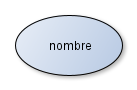
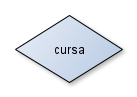
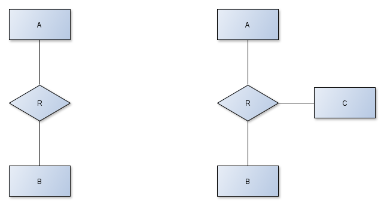
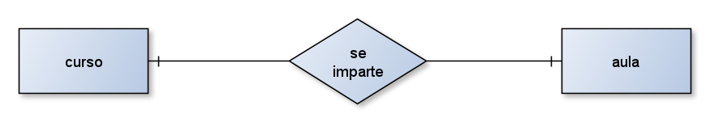
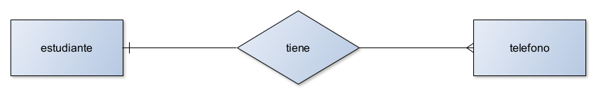
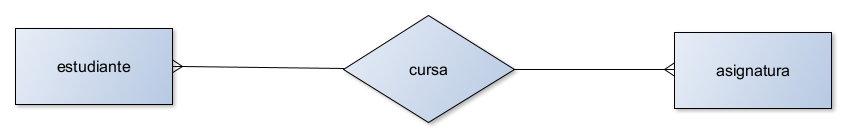
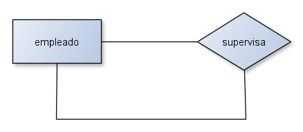

El modelo _Entidad-Relación_ representa la realidad a través de entidades, que son objetos que existen y se distinguen de otros por sus características, a los cuales llamamos _atributos_. Además, estas entidades podrán o no, estar relacionadas unas con otras a través de lo que se conoce como _relación_.

Ten en cuenta que se trata solo de un modelo de representación, por lo que no tiene correspondencia real con ningún sistema de almacenamiento. Se utiliza en la etapa de análisis y diseño de una base de datos, por lo que tendrás que convertirlo en tablas antes de poder empezar a trabajar con él.

# Diagrama Entidad-Relación

El diagrama _Entidad-Relación_ es una representación gráfica del modelo anterior. Es una forma visual de presentar las entidades, sus atributos y las relaciones entre ellas.

> **Tip**: Para crear diagramas de entidad-relación, puedes utilizar una amplia gama de programas, como: [yEd Graphic Editor](https://www.yworks.com/products/yed), [Draw.io,](https://www.drawio.com/) [Figma](https://www.figma.com/) o [Google Drawings](https://docs.google.com/drawings).

## **Entidad**

Una entidad es un objeto que existe en la realidad que quieres representar, por ejemplo, un alumno, una asignatura, etc.

En un diagrama _Entidad-Relación_ las entidades se representan por el siguiente símbolo:

## **Atributos**

Los atributos son esas características que hacen que una entidad se distinga de otras. En el caso de un alumno: el nombre o el DNI podrían ser atributos de dicha entidad. Los atributos se representan por el siguiente símbolo:

## **Relación**

A su vez, puedes relacionar unas entidades con otras a través de lo que se conoce como relación. Por ejemplo, las entidades **_alumno_** y **_asignatura_** podrían estar relacionadas entre sí puesto que un alumno _cursa_ una (o varias) asignaturas. Conviene resaltar que una relación entre dos entidades no expresa obligatoriedad de relación sino posibilidad de relacionarse.

En este caso, no será necesario que todos los alumnos _cursen_ una asignatura o que una asignatura _sea cursada_ por todos los alumnos para que la relación se establezca. Por tanto, en este caso se establece que entre esas dos entidades existe una relación a la que podrías llamar _cursa_. Las relaciones se representan por el siguiente símbolo:

### **Cardinalidad de la relación**

Si consideras que dos entidades **_A_** y **_B_** están relacionadas a través de una relación _R_, debes determinar lo que se conoce como cardinalidad de la relación, que determina cuantas entidades de tipo _A_ se relacionan como máximo con cuantas entidades de tipo _B_. Ejemplo:

Existen tres tipos de relaciones en el **_modelo ER_**: uno a uno (1:1), uno a muchos (1:N) y muchos a muchos (N:M). La elección del tipo de relación depende de cómo interactúan las entidades entre sí en el mundo real:

#### **Relación de uno a uno**

En esta relación una entidad de tipo _A_ solo se puede relacionar con una de tipo _B_ y viceversa. Por ejemplo, la entidad **_A_** representa un **_curso_** y la entidad **_B_** representa un **_aula_**. Ambas tablas están relacionadas a través de una relación "_se imparte_": en un aula se imparte un curso y viceversa. En este caso se supone que un curso solo puede ser impartido en un aula concreta y que, en un aula, solo puede impartirse un curso concreto. De esta forma no se permite la posibilidad de que en un aula se imparta más de un curso ni de que un curso se imparta en más de un aula. Se indica con un palito en el lado de la entidad de tipo _A_ y con un palito al lado de la entidad de tipo _B_.

En esta situación nos llevamos la _clave primaria_ de la entidad **_A_** como _clave foránea_ a la entidad **_B_**. También podemos hacer a la inversa y llevarnos la _clave primaria_ de la entidad **_B_** como _clave foránea_ a la entidad **_A_** pero en ningún caso debemos combinar ambas opciones.

#### **Relación de uno a muchos**

Indica que una entidad de tipo _A_ se puede relacionar con un número indeterminado de entidades de tipo _B_, pero a su vez una entidad de tipo _B_ solo puede relacionarse con una entidad de tipo _A_. Imagina una entidad **_estudiante_** y otra **_telefono_** relacionadas a través de una relación _"tiene"_. Puedes suponer que un estudiante puede tener varios teléfonos, pero cada teléfono sólo puede pertenecer a un estudiante. Se indica con un palito en el lado de la entidad de tipo _A_ y con tres palitos al lado de la entidad de tipo _B_.

En este caso nos llevamos la _clave primaria_ de la entidad **_A_** como _clave foránea_ a la entidad **_B_** (no es posible a la inversa).

#### **Relación de muchos a muchos**

En este caso, tanto las entidades de tipo _A_ como las de _B_ pueden relacionarse con un número indeterminado de entidades del otro tipo. Por ejemplo, piensa en las entidades **_estudiante_** y **_asignatura_** y una relación _"cursa"_. Puedes suponer que un alumno cursa varias asignaturas mientras que una asignatura es cursada por varios alumnos. Se indica con los tres palitos a ambos lados de cada relación.

En una relación de muchos a muchos la propia relación, en este caso _"cursa"_, se convierte en una entidad. Dicha entidad ha de tener su propia _clave primaria_ y las _claves foráneas_ de las tablas de ambos lados de la relación.

### **Reflexividad**

Es posible que la misma entidad se relacione consigo misma. En ese caso estamos frente a lo que se conoce como _relación reflexiva_. La cardinalidad de la relación indicará si todos los elementos de la relación están relacionados reflexivamente o bien solo algunos están relacionados entre sí.

En el caso de la siguiente figura podría suponer una empresa en la que algunos empleados hacen de supervisor de otros:

## Tipos de atributos

En un diagrama _Entidad-Relación_, los tipos de atributos más importantes son:

- **Atributo simple:** almacena información indivisible, como un nombre o una fecha. Por ejemplo, el atributo _nombre_ en una entidad **_alumno_**.
    
- **Atributo compuesto:** se compone de sub-atributos con significados propios. Por ejemplo, el atributo _dirección_ en una entidad **_cliente_**. El atributo _dirección_ es compuesto porque se compone de _calle_, _piso_, _puerta_, _ciudad_ y _código postal_.
    
- **Atributo multivaluado:** puede tener varios valores, como podría ser el atributo _número de teléfono_.
    
- **Atributo derivado:** se calcula a partir de otros atributos. La _edad_ es un claro ejemplo porque se puede calcular a través de la fecha de nacimiento.

## Comprobaciones sobre el Diagrama Entidad-Relación

Para asegurarte de que un diagrama _Entidad-Relación_ esté correcto, es recomendable realizar las siguientes comprobaciones:

1. **Identificación de entidades:** asegúrate de que todas las entidades importantes estén representadas en el diagrama y que no haya entidades redundantes.
    
2. **Atributos:** verifica que los atributos en cada entidad sean adecuados y representen información relevante. Evita atributos duplicados o innecesarios.
    
3. **Relaciones:** confirma que las relaciones entre entidades estén bien definidas y reflejen cómo se conectan las entidades en la realidad.
    
4. **Cardinalidad:** verifica que las cardinalidades (números de instancias relacionadas) sean apropiadas y reflejen la realidad. Por ejemplo, una entidad **_propietario_** puede estar relacionada con **_vehículo_** en una relación _1:N_.
    
5. **Claves primarias:** asegúrate de que cada entidad tenga una _clave primaria única_ y que se haya identificado correctamente.
    
6. **Atributos derivados:** revisa que los atributos derivados estén correctamente calculados a partir de otros atributos.
    
7. **Atributos compuestos y multivaluados:** verifica que los atributos compuestos y multivaluados estén definidos adecuadamente.
    
8. **Foreign keys:** confirma que las _foreign keys_ (claves foráneas) en las relaciones reflejen correctamente las conexiones entre las entidades.

